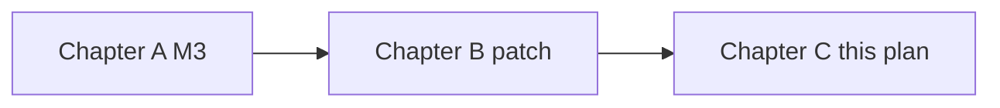

# Chapter C — Harden (after M3)

Candidate craft list — not auto-in for `v0.4.0-rc1`. Copy a todo into
[`docs/plans/0.4.0-rc1.md`](../../docs/plans/0.4.0-rc1.md) if you want it
in that tag. Originally: after M3 (Chapter A) and a stabilize patch
(Chapter B). Still not a feature backlog.

**Job:** operator-facing words and one restart hole. Delete/clarify. No AGENTS.md, no hop table, no Stage 5–6, no `E_GATE_FAILED` / `logs/gates/` rename.

**Exit:** suite green; a `CHANGELOG.md` In / Out / Known limits block; new `bin/README.md` ambiguity entries for the decisions below; tag when you are ready (`v1.0.1` or craft-only `v1.1.0`).

**Out:** AGENTS.md, dropping `.mdc`, `conveyor unpark`, renaming `workflows.py`, renaming `.conveyor/inbox/`, HTTP path `/api/inbox/*`, UI Inbox tab rename, `E_GATE_FAILED` / `logs/gates/`, Appendix B.



---

## 1. Role files describe any belt

Shipped presets include `solo-coder` ([`lib/conveyor/presets.py`](lib/conveyor/presets.py)). [`roles/coder.md`](roles/coder.md) still says `to: reviewer`.

In `roles/*.md` and [`intake/ticket-reviewer.md`](intake/ticket-reviewer.md):

- Recipients come from `conveyor.conf`. Point at the `E_BAD_ROUTE` repair list, not a hardcoded next role.
- Last-role `reviewer.md` may keep `to: done` / `findings` to the previous role as the _shape_, but say “penultimate role on this belt,” not “coder,” if you touch that file.
- Replace “pack” / “coding pack” with “belt” / “role order.”

In [`constitution/handoffs.md`](constitution/handoffs.md): drop “coding-pack” and “two-pack” as headings; keep one example table labeled as the default Review belt.

In [`docs/conveyor-handoff-protocol.md`](docs/conveyor-handoff-protocol.md) §3.2: same pack → belt wording (this doc wins; shipped files stay the translation). §10 `conveyor task`: first role on the belt, not hardcoded `coder`.

Do **not** change two-role test drafts (`test/test_errors.py` `GOOD`, fake-agent scripts). Those are fixtures for the default belt.

---

## 2. Untangle “gate” in code and copy (no protocol-code rename)

Keep `gate <role>`, `E_GATE_FAILED`, and `.conveyor/logs/gates/`.

- Rename `gate()` → `audit()` in [`bin/handoff.sh`](bin/handoff.sh) (def at 201, call at 150). Behavior unchanged.
- One sentence in [`constitution/handoffs.md`](constitution/handoffs.md) and the runbook: `E_GATE_FAILED` is the project test command; `AUDIT_REQUIRED` is the two-call audit; `gate <role>` is the human hold.
- Protocol §5 title stays “The audit gate.” Do not invent a fourth word.

---

## 3. Replace `conveyor inbox approve|skip`

Path `.conveyor/inbox/<id>/` and the Python module `inbox` stay. The **operator verb** moves under `intake`.

Fold today’s [`cmd_inbox`](bin/conveyor) (579–617) into [`cmd_intake`](bin/conveyor) (506), dispatched like `config` / `jira`:

```
conveyor intake approve <id> [--name <task>]
conveyor intake skip <id>
```

- Delete `COMMANDS["inbox"]`. `conveyor inbox …` dies via the existing unknown-command path; usage banner lists the new form only.
- Add `approve` and `skip` to `RESERVED_IDS` in [`lib/conveyor/inbox.py`](lib/conveyor/inbox.py) (today `{"config", "jira"}`). Extend [`test/test_intake_cli.py`](test/test_intake_cli.py) `test_reserved_ids_skip_config_and_jira`.
- [`ui/server/cli.py`](ui/server/cli.py) `inbox_approve` / `inbox_skip` call `intake approve|skip`. Keep `/api/inbox/approve` and `/api/inbox/skip` — they match the directory, not the old CLI verb.
- Update [`test/test_inbox.py`](test/test_inbox.py) (`inbox approve` / `inbox skip` at 23 and 73), protocol §1 / §2.3 writer table, [`docs/runbook.md`](docs/runbook.md) §4, [`README.md`](README.md), [`bin/README.md`](bin/README.md) usage, [`CLAUDE.md`](CLAUDE.md) CLI list.

`conveyor approve` (held handoff) is unchanged.

---

## 4. Board copy: lane + counters

One paragraph in protocol §8 and a matching line in [`CLAUDE.md`](CLAUDE.md):

- Queues (directory location) are authoritative for where the `*.handoff` is.
- `board.tsv` is authoritative for `lane`, `task_id`, `audit_count`, `retry_count`, `started_at`.
- `E_NOT_MY_TASK` reading `lane` is intentional, not a bug.

No column or writer changes.

Also add `inbox.lock` and `workflows.lock` to protocol §8.2 (they already exist in [`lib/conveyor/layout.py`](lib/conveyor/layout.py)).

---

## 5. Restart recovers last validator output

[`bin/role-loop.sh`](bin/role-loop.sh) `process()` sets `last_err = None` (line 125). After a crash with `attempt > 1`, the prompt says “No handoff.sh call was observed” even when `.conveyor/logs/<role>/<task>_<id>_a<n>.jsonl` exists. Protocol §6.8 already requires a log scan; [`bin/README.md`](bin/README.md) item 10 only covers the in-process case.

On `process()` entry, if `attempt > 1`, scan the newest earlier log for that `task` + handoff `id` with the existing `VALIDATOR_RE` (same as `run_agent` 226–229). Seed `last_err` from that. Do not parse agent prose.

Add a regression (extend [`test/test_inv11_restart.py`](test/test_inv11_restart.py) or a small loop `--once` test): plant `in_process` with `attempt: 2` and a prior jsonl containing `E_DIRTY: …`; assert the next run’s prompt / new jsonl includes that line.

---

## 6. Protocol/docs: merge owner

The loop calls `queue.merge` ([`bin/role-loop.sh`](bin/role-loop.sh) 105), not `bin/merge.sh`. `merge.sh` stays the operator/test entry (inv05, inv10).

Protocol §6.3 / §7.3 and [`CLAUDE.md`](CLAUDE.md) line 59: the loop merges via the shared implementation; `merge.sh` is the CLI. Do not add a subprocess wrap.

---

## 7. Chapter C artifacts

- [`CHANGELOG.md`](CHANGELOG.md): next tag In / Out / Known limits (same shape as `0.3.0-rc1`).
- [`bin/README.md`](bin/README.md) Ambiguities: reserved ids `approve`/`skip`; board is lane+counters; loop vs `merge.sh`; `gate()` is now `audit()` and `E_GATE_FAILED` is deliberately the test-command code.
- Do **not** write a new `docs/plans/harden-notes.md` unless the ambiguities file gets too long.

---

## Verification

```
cd test && python3 -m unittest discover -p 'test_*.py'
```

No live Cursor / M3 re-run required for this chapter unless Chapter B already scheduled one.
