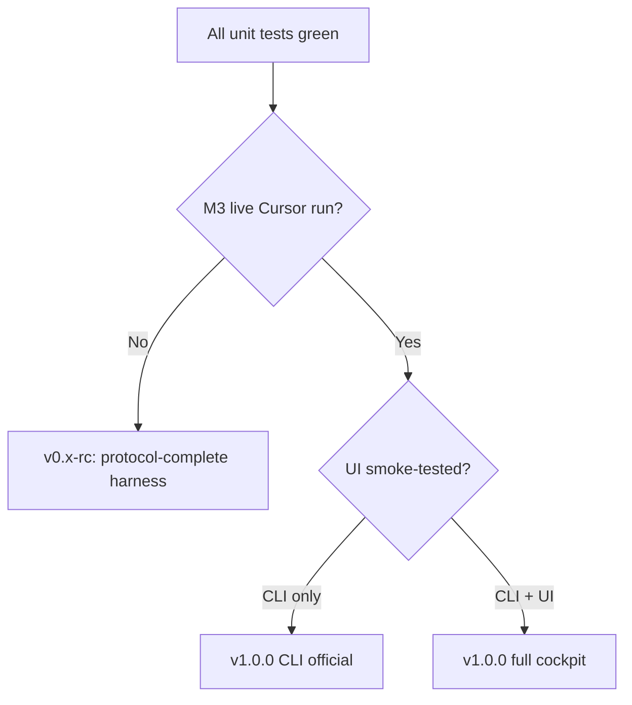

# Conveyor — Release Review Guide

A practical checklist for reviewing the project and cutting an **official usable** release.
Grounded in the PRD (`docs/conveyor-prd.md` §9), `IMPLEMENT.md`, the conformance matrix,
and the moat scan.

**Last reviewed:** 2026-09-06

---

## Where you are

The project defines **“ship after M4”** in the PRD, with one manual gate on top:

| Milestone | Status | Proof |
|-----------|--------|-------|
| **M0** Harness | Done (automated) | `conveyor start`, worktrees, model check |
| **M1** Protocol + crash resume | Done (automated) | `test/test_inv11_restart.py`, fake-agent round-trip |
| **M2** Audit gate + bylines | Done (automated) | `test/test_m2_gate.py`, `test/test_inv08_audit_first.py` |
| **M4** Ceilings + status | Done (automated) | `test/test_m4_ceilings.py` |
| **M3** First live Cursor run | **Not done** | No `test/fixtures/m3/`; called out in `IMPLEMENT.md`, `CHANGELOG.md`, `docs/plans/moat-gap-scan.md` |

Stages 0–4 (n-role pipelines, workflow CRUD, UI cockpit, intake module) shipped in
`v0.3.0-rc1`. Work after that lands on `main`. The next named snapshot is
**`v0.4.0-rc1`** when the tree is thicker than an rc1 bugfix (see
[`CHANGELOG.md`](../CHANGELOG.md) Unreleased and [`docs/plans/0.4.0-rc1.md`](plans/0.4.0-rc1.md)).
`v1.0.0` still means M3 archived + D2 documented, not “more features.”
Confirm the tag’s tree matches the changelog — do not release from an
undocumented working tree.

---

## Release review checklist (in order)

### 1. Freeze scope — what is “official usable”?

Pick one of these; they imply different release bars:

**Option A — PRD MVP (recommended minimum for “official”)**

- CLI only is enough (`bin/conveyor` on `PATH`)
- Default Review belt: `coder → reviewer`
- Intake/inbox, workflow CRUD, UI are **optional extras** but can ship if tested
- **M3 is required** before you call it usable with real Cursor

**Option B — CLI + UI cockpit**

- Everything in A, plus `conveyor-ui` / `ui/` built and smoke-tested
- UI was labeled **preview** in 0.1.0 changelog; 0.2.0 changelog lists it as “In” but M3 was still “Out”
- Stage 5–6 (chime, theme pass) are explicitly **not planned** — do not block on them

**Option C — “Harness only” (not recommended as “official”)**

- Ship after M0–M2 + M4 with fake-agent tests only
- Fine for contributors; **not** what the PRD means by “ship”

Write the choice in `CHANGELOG.md` under a new version section before tagging.

---

### 2. Run the automated gate (must be green)

From repo root:

```bash
cd test && python3 -m unittest discover -p 'test_*.py'
```

Expected: **237 tests, all OK**. Any failure is a release blocker.

If you ship UI:

```bash
cd ui && npm ci && npx tsc -p tsconfig.app.json --noEmit && npm run build
```

Then a manual smoke: start API against a fixture repo, click through Inbox → Board → Workflow → Roles.

---

### 3. Complete M3 — the real release gate

This is the one milestone **no test can substitute for**. PRD criterion:

> A real task on a real repo completes with Cursor; reviewer issues `findings` at least once; coder addresses them.

**Suggested M3 script** (from `IMPLEMENT.md`):

1. Use a **small real repo** (or a throwaway clone), not the Conveyor repo itself.
2. `conveyor init`, edit `project.md` (working `## Test command`), set two models from **different families** in `conveyor.conf`.
3. Verify prerequisites from `docs/runbook.md` §1:
   - `cursor-agent --version`
   - `CURSOR_API_KEY` or interactive login works with `-p --force`
4. Create a task with **three numbered requirements**, one deliberately **not** covered by the coder’s first tests.
5. `conveyor start`, `conveyor task <name>`, watch through:
   - coder `ready` → reviewer `findings` → coder fix → reviewer `pass` → merge on `main`
6. Confirm:
   - `conveyor status` matches runbook §6 format
   - audit gate fired at least once (`audit_count` > 0 on board)
   - bylines on commits (`By coder.`, `By reviewer.`)
7. **Archive evidence**: save logs under `test/fixtures/m3/` (or `docs/fixtures/m3/`) — task file, `board.tsv` snapshots, relevant `.conveyor/logs/*/*.jsonl`.

If M3 fails, classify the failure:

- **Cursor CLI / API / plan** → document in runbook, pin `agent_version` in config
- **Prompt/role gap** → fix `roles/*.md` or constitution, re-run
- **Protocol bug** → fix code, add regression test, re-run M3

Until M3 passes, label the release **“protocol-complete, live-run unverified”** — not “official usable with Cursor.”

---

### 4. Walk the conformance matrix

Use [`conveyor-conformance-matrix.md`](../conveyor-conformance-matrix.md) as your **product completeness** checklist. For release:

- Most rows are `[x] full` or `[~] simplified` — good for MVP
- **Resolve or document the two `[!]` decisions** before calling it 1.0:

**D1 — Contract files are committed**

Already a deliberate choice; amend `conveyor-manual.md` if needed so it matches reality (runtime gitignored, contract committed).

**D2 — Auto-merge on `pass`**

Still an open product choice. Options in the matrix:

- (a) accept auto-merge for trusted tasks
- (b) stop auto-merge, leave branch for human read
- (c) post-pass hold before merge

Record the decision in the matrix and PRD §12 so operators know what “done” means.

---

### 5. Walk the moat scan (honesty pass)

Use [`docs/plans/moat-gap-scan.md`](plans/moat-gap-scan.md) to avoid **overclaiming**. Key findings for release notes:

**Enforced (safe to claim):**

- Filesystem/git coordination, rename-only queues, audit gate, ceilings, identity from env, routes from config, outbox-only success signal

**Prompt-only (do not claim as enforced):**

- Reviewer never edits code — role file says so; loop does not refuse a committing reviewer

**Known missing (fine for MVP, say so in docs):**

- Structured multi-gate hop table, `{inbound}` substitutions, UI “Run now” for gates
- Skills/MCP/sandbox per role (Appendix B territory)

**Ship-blocker rule from the scan:** any §1 “moat” row you **claim as enforced** must not be Missing or Prompt-only. The reviewer-edits row is the main honesty gap.

---

### 6. Operator experience review (manual, ~30 min)

Follow [`docs/runbook.md`](runbook.md) end-to-end on a clean fixture repo:

| Flow | Commands to verify |
|------|-------------------|
| Cold setup | `conveyor init` → edit conf → `conveyor start` |
| Happy path | `conveyor task …` → status → log → merged on `main` |
| Park + resume | Force `max-retries` or use M4 fixture pattern → read `reason` → `conveyor resume` |
| Stop modes | `conveyor stop` vs `stop --now`; reboot → `conveyor start` resumes |
| Gate (if shipping 3-role) | Specifier `ready` held → `conveyor approve` / `reject` |
| Intake (if in scope) | `import` → `intake` → `inbox approve` → task created |
| Workflow switch | `conveyor workflow list/activate` with loops stopped |
| Wipe/recover | Runbook §7 recovery paths |

Compare every `conveyor status` line to the sample in runbook §6.

---

### 7. Documentation alignment pass

Before tagging, grep for stale copy:

| Doc | Check |
|-----|-------|
| `README.md` | Install, command list, UI description matches shipped scope |
| `conveyor-manual.md` | Glance should say UI ships in v0.3.0-rc1; CLI alone is sufficient |
| `CHANGELOG.md` | Unreleased buckets match [`docs/plans/0.4.0-rc1.md`](plans/0.4.0-rc1.md); at tag time rename Unreleased → `0.4.0-rc1` and list M3 status |
| `IMPLEMENT.md` | Update M3 status after live run |
| `docs/conveyor-prd.md` | Still “Draft v0.3” — bump status when you release |
| `docs/plans/moat-gap-scan.md` | Refresh test count and date |

Open PRD questions worth deciding before 1.0 (not blockers, but operators will hit them):

- Can reviewer fix trivial formatting?
- Can coder push back on findings with rationale?

---

### 8. Repository hygiene (before tag)

1. **Commit strategy**: Land on `main` as you go. Nothing intended for the tag should stay untracked.
2. **Tag**: `v0.4.0-rc1` for the next thicker snapshot (M3 may still be open); `v0.3.0-rc2` only for a thin rc1 patch with no new product; `v1.0.0` only when M3 is archived and D2 is documented.
3. **Version numbering**: `0.1` CLI, `0.2` workflows/UI (untagged), `0.3` intake + cockpit. Another product bump is **0.4**. `1.0.0` means live Cursor verified, not a longer changelog. Rules in [`docs/plans/next-chapters.md`](plans/next-chapters.md).
4. **`.gitignore`**: Ensure `.conveyor/`, `.worktrees/`, `ui/node_modules/`, `.conveyor/local/jira.json` patterns are correct for operators cloning Conveyor vs using it in target repos.
5. **No secrets**: Confirm no tokens in tracked files; Jira creds stay in gitignored path.

---

## Suggested release tiers



| Tier | Label | Requirements |
|------|-------|--------------|
| **RC (shipped)** | `v0.3.0-rc1` | Tests green, docs aligned, UI smoke; M3 not done |
| **Next snapshot** | `v0.4.0-rc1` | Features + fixes + maintenance on `main`; tests green; plan + Unreleased agree; M3 may still be open |
| **Thin rc1 patch** | `v0.3.0-rc2` | Optional. Same surface as rc1, bugs only |
| **Official CLI** | `v1.0.0` | A tagged RC + M3 archived + D2 documented |
| **Official + UI** | `v1.0.0` (same tag, broader notes) | Above + UI build + manual cockpit smoke |

### Shipped RC (`v0.3.0-rc1`)

**CLI + core UI cockpit**, protocol-complete, live Cursor unverified.

- **In the tag:** tests green (~237), docs aligned (`CHANGELOG.md` 0.3.0-rc1), Inbox/Board/Workflow/Roles smoke
- **After the tag:** M3 may run against **this tagged build** while `main` moves toward 0.4. Archive `test/fixtures/m3/`. Fixes ride into 0.4 unless you cut a thin `v0.3.0-rc2`.
- **Not required for that RC:** chime, async intake HTTP, “Run now” gates, D2 auto-merge decision, extra `test_ui_api.py` coverage

### Next snapshot (`v0.4.0-rc1`)

Scope is whatever you put in [`docs/plans/0.4.0-rc1.md`](plans/0.4.0-rc1.md) and have landed under CHANGELOG Unreleased. Same review bar: suite green, UI `tsc`/`build` if `ui/` changed, changelog matches the tree.

---

## Recommended sequence

1. **Edit** [`docs/plans/0.4.0-rc1.md`](plans/0.4.0-rc1.md) as you decide what belongs in the next tag.
2. **Land** work on `main`; keep CHANGELOG **Unreleased** in sync.
3. **M3** on `v0.3.0-rc1` (or later on 0.4); archive fixtures; put proven bugs under Fixes.
4. **When the plan and the tree agree:** suite + UI build green; rename Unreleased → `0.4.0-rc1`; tag `v0.4.0-rc1`.
5. **Resolve D2** (auto-merge policy) in `conveyor-conformance-matrix.md` before calling it official.
6. **One operator dry-run** using only `docs/runbook.md` (no reading source).
7. **Cut `v1.0.0`** when M3 is archived and D2 is documented (that tree may be 0.4).

---

## Bottom line

**Automated protocol work (M0–M2, M4) and Stage 4 features look implementation-complete on disk**, with strong invariant coverage and honest gap documentation. What blocks an **official usable** release in the project’s own terms is:

1. **M3** — first successful live Cursor pipeline with findings loop
2. **Git/release hygiene** — intended release contents committed and tagged
3. **Explicit scope call** — CLI-only vs CLI+UI, and documenting D2 (auto-merge)

---

## Related docs

| Doc | Role |
|-----|------|
| [`docs/conveyor-prd.md`](conveyor-prd.md) | Scope and milestones (§9) |
| [`IMPLEMENT.md`](../IMPLEMENT.md) | Implementer brief; M3 exit criterion |
| [`docs/runbook.md`](runbook.md) | Operator setup and day-to-day |
| [`conveyor-conformance-matrix.md`](../conveyor-conformance-matrix.md) | Manual ↔ MVP mapping |
| [`docs/plans/moat-gap-scan.md`](plans/moat-gap-scan.md) | Enforced vs prompt-only vs overclaim |
| [`docs/plans/next-chapters.md`](plans/next-chapters.md) | Versioning: 0.4-rc1 next; 1.0.0 = M3 proven |
| [`docs/plans/0.4.0-rc1.md`](plans/0.4.0-rc1.md) | Intended contents of the next tag (edit this) |
| [`CHANGELOG.md`](../CHANGELOG.md) | Version history and release notes |
| [`conveyor-manual.md`](../conveyor-manual.md) | User manual and build checklist |
